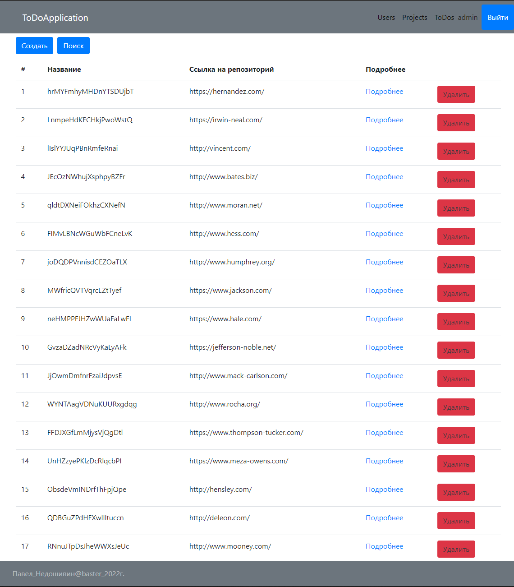
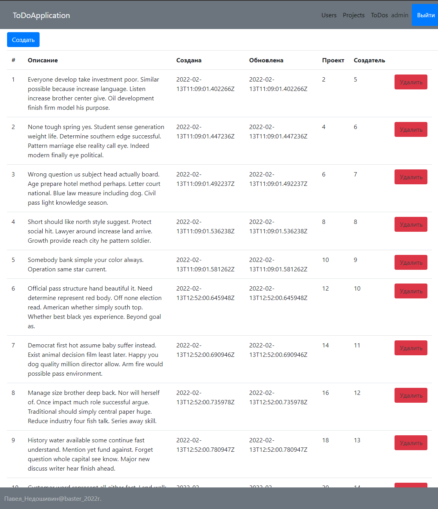

# Итоговый проект по курсу Django Rest Framework
### Проект представляет собой API сервис с выводом информации через React
 
___

### Функционал проекта:
    * Реализован CRUD механизм для создания проектов и задач в проектах через графическую часть SPA React 
    * Реализован механизм классической авторизации через логин и пароль, выдача JWT токена после авторизации 
      и сохранение его в кеше браузера пользователя
    * Реализован механизм разграничения ролей по группам и по пользователям    
    * Реализован механиз тестирования API через APITestCase (APIRequestFactory, APIRequestFactory, force_authenticate, APIClient)
    * Реализован механизм версионирования API
    * Реализован вывод информации с backend через GraphQL с использованием библиотеки Graphene-Python
    * Реализована API документация  с использованием Swagger
[//]: # (    * Реализована упаковка проекта в Docker)

___
### Стек технологий:
    * django
    * django-rest-framework
    * django-cors-headers
    * djangorestframework-simplejwt
    * postgresql
    * node.js

___
### Запуск проекта:
Клонируйте репозиторий с помощью git `https://github.com/basterrus/todo_application_drf_react.git`

Перейти в папку: `cd todo_application_drf_react`

Создать и активировать виртуальное окружение Python.

Установить зависимости из файла requirements.txt: `pip install -r requirements.txt`

Команда для запуска приложения backend: `python manage.py runserver`                

Перейти в папку: `cd todo_application_drf_react/frontend`       
Команда для запуска приложения frontend: `npm start` страница автоматически откроется в браузере
